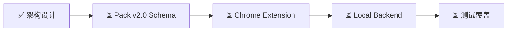

# 🤖 AI Collab Base

<div align="center">

**本地优先的 AI 聊天自动化执行平台**

[](https://github.com/17Mojo/ai-collab-base/stargazers)
[](https://github.com/17Mojo/ai-collab-base/network/members)
[](https://github.com/17Mojo/ai-collab-base/blob/main/LICENSE)
[](https://python.org)

[English](#english) | [中文文档](#中文文档)

</div>

---

## 中文文档

### 📖 项目简介

**AI Collab Base** 是一个开源的 AI 聊天自动化工具，通过 Chrome 扩展实现多 AI 平台的内容生成自动化。核心理念是 **零成本、零配置、完全离线可用**。

> 💡 **姊妹项目**: [ai-collab-research](https://github.com/17Mojo/ai-collab-research) - 研究成果 + 防遗忘工具

### ✨ 核心特性

#### 🎯 Prompt Pack v2.0

| 特性 | 描述 |
|------|------|
| **多平台支持** | ChatGPT、Claude、Gemini、Kimi、通义千问、智谱清言等 **10+ 平台** |
| **Pack 工作流** | 支持 **6 种步骤类型** + 分支逻辑 + 正则表达式匹配 |
| **知识增强** | NotebookLM 集成，**21+ 知识源**注入 |

#### 🤝 动态角色编排架构

本项目采用**角色别名驱动**的动态协作架构，Agent 提供商通过配置动态绑定：

```text
角色代号          显示名称      RACI 定位      职责
──────────────────────────────────────────────────────────
AGENT_EXEC      主执行者      Responsible    代码实现、重构、Bug修复
AGENT_ARCH      架构师        Accountable    架构设计、技术选型、代码审查
AGENT_TEST      测试验证      Consulted      单元测试、集成测试、质量保证
AGENT_DOC       文档编写      Consulted      文档撰写、使用说明
```

**命令协议**:

| 命令前缀 | 触发角色 | 用途 |
|---------|---------|------|
| `X.RUN` | AGENT_EXEC | 执行任务 |
| `A.RUN` | AGENT_ARCH | 架构决策 |
| `C.RUN` | AGENT_TEST | 测试验证 |

### 🚀 快速开始

#### 1. 克隆项目

```bash
git clone https://github.com/17Mojo/ai-collab-base.git
cd ai-collab-base
```

#### 2. 安装依赖

```bash
# Python 依赖
pip install -r requirements.txt

# 或使用虚拟环境
python -m venv venv
source venv/bin/activate  # Linux/Mac
pip install -r requirements.txt
```

#### 3. 冷启动配置（首次使用）

```bash
# CLI 方式配置角色绑定
python3 -m src.cli orchestration cold-start
```

#### 4. 启动后端服务

```bash
cd local-backend
uvicorn app.main:app --reload --port 8000

# 访问 API 文档
open http://127.0.0.1:8000/docs
```

#### 5. 安装 Chrome 扩展

1. Chrome 浏览器访问 `chrome://extensions/`
2. 开启 **开发者模式**
3. 点击 **加载已解压的扩展程序**
4. 选择 `chrome-extension/` 目录

### 📁 项目结构

```text
ai-collab-base/
├── 📂 chrome-extension/    # Chrome 扩展代码
│   ├── manifest.json       # Manifest V3 配置
│   ├── content-scripts/    # 内容脚本
│   └── background/         # 后台服务
│
├── 📂 local-backend/       # FastAPI 后端
│   ├── app/                # 应用代码
│   └── main.py             # 入口文件
│
├── 📂 src/                 # Python 源代码
│   ├── ai_collab/          # AI 协作模块
│   │   ├── orchestration.py # 角色编排核心
│   │   ├── pack/           # Pack Schema
│   │   └── notification.py # 通知系统
│   └── cli.py              # CLI 工具
│
├── 📂 config/              # 配置文件
│   ├── agent-orchestration.json      # 角色编排配置
│   ├── agent-orchestration.schema.json # JSON Schema
│   └── agent-orchestration.template.json # 配置模板
│
├── 📂 collaboration/       # 协作配置与文档
│   ├── PROTOCOL.md         # 多 Agent 协作协议 (v3.0)
│   ├── COLLABORATION_GUIDELINES.md  # 协作准则
│   ├── guides/             # 操作指南
│   │   └ MENU_INTERACTION_SPEC.md  # /menu 交互规范
│   └ skills/               # 技能定义
│   │   └ menu_skill.md     # /menu 技能
│
├── 📂 rules/               # AI 协作规则
│   ├── AI-COLLABORATION-STANDARDS.md # 协作标准
│   └ OWNERSHIP.md          # 模块所有权
│
├── 📂 logs/                # 日志与状态
│   └ collaboration_state.json       # 协作状态
│
├── 📄 ARCHITECTURE.md      # 系统架构设计
├── 📄 CLAUDE.md            # 项目说明
└── 📄 README.md            # 本文档
```

### 🔧 CLI 命令参考

```bash
# 查看当前角色绑定状态
python3 -m src.cli orchestration status

# 冷启动配置
python3 -m src.cli orchestration cold-start

# 检测可用 Agent 服务商
python3 -m src.cli orchestration detect

# 角色管理
python3 -m src.cli orchestration roles list
python3 -m src.cli orchestration roles activate --role-id AGENT_EXEC --provider claude_code
python3 -m src.cli orchestration roles deactivate --role-id AGENT_EXEC

# 快照管理
python3 -m src.cli orchestration snapshot create --note "备份"
python3 -m src.cli orchestration snapshot rollback --snapshot-id snap_001

# 查看变更历史
python3 -m src.cli orchestration history --limit 20

# 系统状态
python3 -m src.cli status --verbose
```

### 📖 详细文档

| 文档 | 描述 |
|------|------|
| [ARCHITECTURE.md](ARCHITECTURE.md) | 系统架构设计 |
| [CLAUDE.md](CLAUDE.md) | 项目说明与 AI 协作规则 |
| [collaboration/PROTOCOL.md](collaboration/PROTOCOL.md) | 多 Agent 协作协议 (v3.0) |
| [collaboration/COLLABORATION_GUIDELINES.md](collaboration/COLLABORATION_GUIDELINES.md) | 协作准则 |
| [collaboration/guides/MENU_INTERACTION_SPEC.md](collaboration/guides/MENU_INTERACTION_SPEC.md) | /menu 交互规范 |
| [rules/AI-COLLABORATION-STANDARDS.md](rules/AI-COLLABORATION-STANDARDS.md) | AI 协作标准 |

### 💻 技术栈

| 类别 | 技术 |
|------|------|
| **前端** | Chrome Extension (Manifest V3), JavaScript |
| **后端** | FastAPI, Python 3.8+ |
| **数据库** | SQLite (单文件) |
| **缓存** | Python lru_cache |
| **协议** | OpenSpec, Dynamic Role Orchestration |

### 📋 使用场景

| 场景 | 模式 | 适用人群 |
|------|------|---------|
| **个人开发** | 单 Agent 模式 | 个人开发者、小型项目 |
| **中型团队** | SubAgent 模式 | 3-10 人团队、中型复杂度 |
| **大型项目** | 多 Agent 模式 | 10+ 人团队、专业分工 |
| **临时扩展** | 动态接入 | 专项任务（性能测试、安全审计） |
| **团队共享** | 配置导出 | 新成员入职、配置统一 |

> 📖 **详细场景指南**: [使用场景指南](collaboration/guides/USAGE_SCENARIOS_GUIDE.md)

### 🛠️ 开发路线



| 阶段 | 状态 | 描述 |
|------|------|------|
| Phase 1 | ✅ 完成 | 架构设计、协议定义 |
| Phase 2 | ⏳ 进行 | Pack v2.0 完整 Schema |
| Phase 3 | ⏳ 待开始 | Chrome Extension Manifest V3 |
| Phase 4 | ⏳ 待开始 | Content Script + DOM Observer |
| Phase 5 | ⏳ 待开始 | Local Backend (FastAPI + SQLite) |

### 🤝 贡献指南

我们欢迎所有形式的贡献！

#### 如何贡献

1. **Fork** 本仓库
2. 创建特性分支 (`git checkout -b feature/AmazingFeature`)
3. 提交更改 (`git commit -m 'Add some AmazingFeature'`)
4. 推送到分支 (`git push origin feature/AmazingFeature`)
5. 开启 **Pull Request**

#### 贡献规范

- 遵循 [AI-COLLABORATION-STANDARDS.md](rules/AI-COLLABORATION-STANDARDS.md) 协作标准
- 代码需通过测试（覆盖率 ≥ 80%）
- 文档需符合模板规范

### 📋 系统要求

| 要求 | 版本 |
|------|------|
| Python | 3.8+ |
| Chrome | 最新版 |
| 操作系统 | Windows / macOS / Linux |

### 📜 许可证

本项目采用 **MIT License** 开源协议 - 查看 [LICENSE](LICENSE) 文件了解详情。

### 👥 作者与致谢

**作者**: [17Mojo](https://github.com/17Mojo)

**致谢**:
- 感谢所有贡献者的支持
- 参考了 [awesome-readme](https://github.com/matiassingers/awesome-readme) 的 README 最佳实践
- 参考了 [Best-README-Template](https://github.com/othneildrew/Best-README-Template) 的模板结构

### 🔗 相关项目

| 项目 | 描述 |
|------|------|
| [ai-collab-research](https://github.com/17Mojo/ai-collab-research) | 研究成果 + 防遗忘工具 |

---

## English

### 📖 About

**AI Collab Base** is an open-source AI chat automation tool that enables multi-platform content generation automation through a Chrome extension. Core philosophy: **Zero cost, zero config, fully offline capable**.

### ✨ Key Features

- **Multi-platform Support**: ChatGPT, Claude, Gemini, Kimi, Qwen, Zhipu, and **10+ platforms**
- **Pack Workflow**: **6 step types** + branching logic + regex matching
- **Knowledge Enhancement**: NotebookLM integration, **21+ knowledge sources**
- **Dynamic Role Orchestration**: Agent providers bound dynamically through configuration

### 🚀 Quick Start

```bash
# Clone repository
git clone https://github.com/17Mojo/ai-collab-base.git
cd ai-collab-base

# Install dependencies
pip install -r requirements.txt

# Cold start configuration
python3 -m src.cli orchestration cold-start

# Start backend
cd local-backend
uvicorn app.main:app --reload --port 8000
```

### 📖 Documentation

| Document | Description |
|----------|-------------|
| [ARCHITECTURE.md](ARCHITECTURE.md) | System Architecture |
| [CLAUDE.md](CLAUDE.md) | Project Guide & AI Collaboration Rules |
| [collaboration/PROTOCOL.md](collaboration/PROTOCOL.md) | Multi-Agent Protocol (v3.0) |

### 📜 License

MIT License - See [LICENSE](LICENSE) for details.

---

<div align="center">

**Made with ❤️ by [17Mojo](https://github.com/17Mojo)**

[⬆ Back to Top](#-ai-collab-base)

</div>