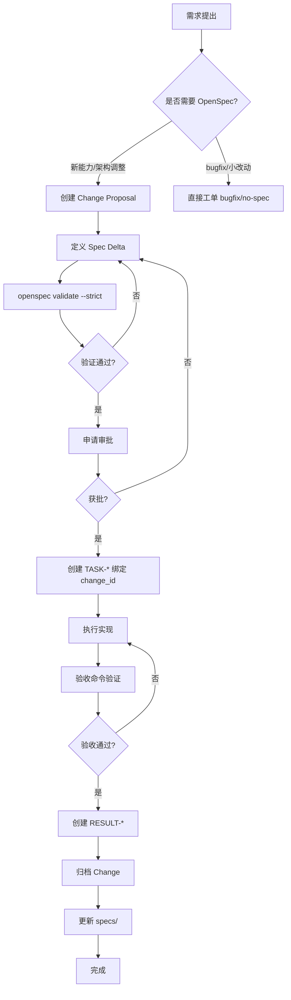

# OpenSpec Pack + Pack Market 工作流指南

**创建日期**: 2026-04-28
**适用范围**: Pack Market 功能开发
**遵循规范**: OpenSpec 三阶段工作流

---

## 一、工作流总览



---

## 二、当前 Pack 规范体系

### 2.1 已归档 Specs

| Spec ID | Requirements 数量 | 覆盖范围 |
|---------|-------------------|----------|
| `pack-requirement-conversion` | 4 | 需求转换、标准产物、冲突检测、双闸校验 |
| `prompt-pack-runtime-style` | 4 | 运行时覆盖、白名单、不可变性、向后兼容 |
| `ai-integration-mode` | 5 | Mock/Fallback/Real 模式、健康检查 |
| `task-governance` | 5 | 工作区治理、周期巡检、门禁阻断 |

### 2.2 待归档 Changes

| Change ID | 状态 | 说明 |
|-----------|------|------|
| `add-prompt-pack-lifecycle-baseline` | 待归档 | Pack 四阶段生命周期 |
| `add-session-orchestration-control-plane` | 进行中 | Session 编排控制面 |

### 2.3 Pack Market 缺失的 Spec

**问题**: Pack Market 功能（TASK-W2-DAY1-PACK-MARKET-001）缺少对应的 OpenSpec Change。

**需要创建**: `add-pack-market-infrastructure`

---

## 三、Pack Market OpenSpec 工作流

### 3.1 Step 1: 创建 Change Proposal

**目录结构**:
```
openspec/changes/add-pack-market-infrastructure/
├── proposal.md          # Why + What + Impact
├── tasks.md             # 实现任务清单
├── design.md            # 技术决策（可选）
└── specs/
    └── pack-market/
        └── spec.md      # Spec Delta
```

**proposal.md 内容**:
```markdown
## Why

当前项目需要 Pack 市场功能，支持：
- Pack 发布与发现
- 用户评分与反馈
- 分类筛选与搜索

缺乏统一规范会导致实现不一致、难以审计。

## What Changes

- 新增 Pack 市场数据模型（PackListing, PackRating, UserFeedback）
- 新增 Pack 市场存储层（SQLite）
- 新增 Pack 市场管理接口（list/search/filter）
- 定义评分与反馈规范约束

## Impact

- Affected specs: `pack-market`（新增）
- Affected code: `src/ai_collab/pack/market.py`, `market_store.py`, `market_api.py`
- 风险: 评分系统需要防止滥用，反馈需要审核机制
```

### 3.2 Step 2: 定义 Spec Delta

**specs/pack-market/spec.md**:
```markdown
## ADDED Requirements

### Requirement: Pack Listing and Discovery
The system SHALL provide pack listing with category, rating, and search capabilities.

#### Scenario: User searches packs by keyword
- **WHEN** user submits a search query
- **THEN** system SHALL return matching packs sorted by relevance
- **AND** SHALL include rating and download count in results

#### Scenario: User filters packs by category
- **WHEN** user selects a category filter
- **THEN** system SHALL return packs belonging to that category
- **AND** SHALL maintain existing sort order

### Requirement: Pack Rating System
The system SHALL support pack rating with 1-5 scale and validation.

#### Scenario: User submits valid rating
- **WHEN** user submits rating between 1 and 5
- **THEN** system SHALL store the rating
- **AND** SHALL update pack average rating

#### Scenario: User submits invalid rating
- **WHEN** user submits rating outside 1-5 range
- **THEN** system SHALL reject the rating
- **AND** SHALL return validation error

### Requirement: User Feedback Collection
The system SHALL collect user feedback with type classification.

#### Scenario: User submits bug feedback
- **WHEN** user submits feedback with type "bug"
- **THEN** system SHALL store feedback with created_at timestamp
- **AND** SHALL mark feedback as pending review

#### Scenario: User submits feature request
- **WHEN** user submits feedback with type "request"
- **THEN** system SHALL store feedback
- **AND** SHALL link to pack_id for tracking

### Requirement: Pack Status Lifecycle
The system SHALL manage pack status through DRAFT/PENDING/APPROVED/REJECTED/ARCHIVED.

#### Scenario: Pack enters pending review
- **WHEN** pack author submits pack for review
- **THEN** system SHALL set status to PENDING
- **AND** SHALL notify reviewers

#### Scenario: Pack is approved
- **WHEN** reviewer approves pending pack
- **THEN** system SHALL set status to APPROVED
- **AND** SHALL make pack visible in market
```

### 3.3 Step 3: 验证

```bash
openspec validate add-pack-market-infrastructure --strict
```

**验证检查点**:
- ✅ 每个 Requirement 有至少 1 个 Scenario
- ✅ Scenario 格式正确（`#### Scenario:` 四个 hashtag）
- ✅ 使用 SHALL/MUST（非 should/may）
- ✅ proposal.md 有 Why/What/Impact 三部分

### 3.4 Step 4: 创建工单绑定

**修复 TASK-W2-DAY1-PACK-MARKET-001.md**:
```markdown
---
task_id: TASK-W2-DAY1-PACK-MARKET-001
change_id: add-pack-market-infrastructure  # ← 修正
status: pending
...
---
```

### 3.5 Step 5: 执行实现

按照 `tasks.md` 清单执行：

```markdown
## 1. Implementation
- [ ] 1.1 Create data models (market.py)
- [ ] 1.2 Create storage layer (market_store.py)
- [ ] 1.3 Create API interface (market_api.py)
- [ ] 1.4 Write unit tests (test_market.py)
- [ ] 1.5 Validate acceptance commands
```

### 3.6 Step 6: 归档

```bash
openspec archive add-pack-market-infrastructure --yes
```

**归档后**:
- 移动: `changes/archive/2026-XX-XX-add-pack-market-infrastructure/`
- 更新: `specs/pack-market/spec.md`（从 delta 合入）

---

## 四、遵循现有 Pack 规范

### 4.1 pack-requirement-conversion 约束

Pack Market 发布流程需要遵循 ReAct 转换：

```
Owner 需求 → Reason → Act → Observe → draft_pack.json → validation_report.md
```

**应用到 Pack Market**:
- 新 Pack 提交 → ReAct 转换 → 生成草案 → 双闸校验 → 发布

### 4.2 prompt-pack-runtime-style 约束

Pack Market 评分/反馈需要遵循运行时不可变性：

```
评分/反馈数据 → 不修改 Pack 基线 → 仅追加元数据
```

**应用到 Pack Market**:
- PackRating/UserFeedback 独立存储
- 不修改 PackListing 基线字段
- 评分影响 `rating` 字段（聚合计算，非直接修改）

### 4.3 prompt-pack-lifecycle 约束

Pack Market 状态管理需要遵循四阶段：

```
DRAFT → PENDING → APPROVED/REJECTED → ARCHIVED
```

**应用到 Pack Market**:
- DRAFT: 作者编辑中
- PENDING: 提交审核
- APPROVED: 发布可见
- REJECTED: 退回修改
- ARCHIVED: 下架归档

---

## 五、验收命令与结果文件

### 5.1 验收命令

```bash
# 单元测试
pytest tests/unit/pack/test_market.py -v --cov=src/ai_collab/pack/market

# 验证覆盖率 ≥ 80%
pytest tests/unit/pack/test_market.py --cov-report=term-missing

# OpenSpec 验证
openspec validate add-pack-market-infrastructure --strict
```

### 5.2 结果文件

**位置**: `collaboration/results/RESULT-PACK-MARKET-INFRASTRUCTURE-*.md`

**内容**:
```markdown
# Pack Market Infrastructure 完成报告

## 验收命令执行

```bash
$ pytest tests/unit/pack/test_market.py -v
===== test session starts =====
tests/unit/pack/test_market.py::test_pack_listing PASSED
tests/unit/pack/test_market.py::test_pack_rating PASSED
...
===== 15 passed in 0.5s =====
```

## Coverage Report

- market.py: 92%
- market_store.py: 85%
- market_api.py: 88%

## OpenSpec 归档

- Change ID: add-pack-market-infrastructure
- Archive Date: 2026-XX-XX
- New Spec: specs/pack-market/spec.md
```

---

## 六、快速启动脚本

```bash
#!/bin/bash
# 创建 Pack Market OpenSpec Change

CHANGE=add-pack-market-infrastructure
mkdir -p openspec/changes/$CHANGE/specs/pack-market

# 创建 proposal.md
cat > openspec/changes/$CHANGE/proposal.md << 'EOF'
## Why
当前项目需要 Pack 市场功能...

## What Changes
- 新增 Pack 市场数据模型...
- 新增 Pack 市场存储层...

## Impact
- Affected specs: pack-market（新增）
EOF

# 创建 tasks.md
cat > openspec/changes/$CHANGE/tasks.md << 'EOF'
## 1. Implementation
- [ ] 1.1 Create data models
- [ ] 1.2 Create storage layer
EOF

# 创建 spec delta
cat > openspec/changes/$CHANGE/specs/pack-market/spec.md << 'EOF'
## ADDED Requirements
### Requirement: Pack Listing and Discovery
...
EOF

# 验证
openspec validate $CHANGE --strict
```

---

## 七、问题修复清单

| 问题 | 当前状态 | 修复方案 |
|------|----------|----------|
| TASK change_id 不匹配 | `add-session-orchestration-control-plane` | 修改为 `add-pack-market-infrastructure` |
| 缺少 pack-market spec | 不存在 | 创建 `specs/pack-market/spec.md` |
| 缺少 OpenSpec Change | 不存在 | 创建 `changes/add-pack-market-infrastructure/` |

---

**下一步行动**: 执行快速启动脚本创建 Pack Market OpenSpec Change Proposal
