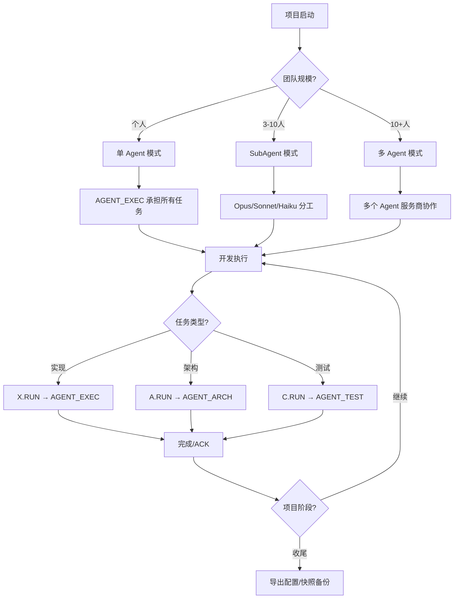

# AI Collab Base 使用场景指南

**版本**: 3.0  
**更新时间**: 2026-05-15  
**适用范围**: 动态角色编排架构下的多 Agent 协作系统

---

## 一、核心功能模块

### 1.1 Prompt Pack v2.0 - AI 聊天自动化

**核心用途**: 自动化多 AI 平台的内容生成

| 功能 | 描述 | 适用场景 |
|------|------|---------|
| 多平台支持 | ChatGPT、Claude、Gemini、Kimi、通义千问等 10+ 平台 | 跨平台内容批量生成 |
| Pack 工作流 | 6 种步骤类型 + 分支逻辑 + 正则匹配 | 复杂对话流程自动化 |
| 知识增强 | NotebookLM 集成，21+ 知识源 | 知识密集型任务 |

### 1.2 动态角色编排 - Agent 协作管理

**核心用途**: 灵活配置多 Agent 协作架构

| 功能 | 描述 | 适用场景 |
|------|------|---------|
| 角色别名 | AGENT_EXEC、AGENT_ARCH、AGENT_TEST 等 | 统一的协作协议 |
| 冷启动配置 | 首次使用时绑定 Agent 提供商 | 新项目初始化 |
| SubAgent 模式 | 单 Agent 内部模型分工 | 资源受限场景 |
| /menu 配置 | 运行时动态调整 | 灵活适配需求变化 |

---

## 二、典型使用场景

### 场景 1: 个人开发者 - 单 Agent 模式

**用户画像**:
- 个人开发者
- 仅使用 Claude Code 或类似工具
- 项目规模小、任务简单

**推荐配置**:
```bash
# 冷启动选择
python3 -m src.cli orchestration cold-start
# 选择 [1] 单 Agent 模式

# 角色绑定
AGENT_EXEC → Claude Code (承担所有实现任务)
AGENT_ARCH → 休眠
AGENT_TEST → 休眠
```

**工作流程**:
```text
1. 输入 X.RUN → AGENT_EXEC 执行任务
2. 完成后返回 X.ACK|task=...|status=ok
3. 需要架构决策时，手动激活 AGENT_ARCH
```

**适用任务类型**:
- 代码实现、Bug 修复
- 小型功能开发
- 文档编写

---

### 场景 2: 中型团队 - SubAgent 模式

**用户画像**:
- 中型团队（3-10 人）
- 使用 Claude Code（支持多模型变体）
- 项目有一定复杂度

**推荐配置**:
```bash
# 冷启动选择
python3 -m src.cli orchestration cold-start
# 选择 [2] SubAgent 模式

# 角色绑定
AGENT_EXEC → Claude Code (Sonnet)
AGENT_ARCH → Claude Code (Opus)
AGENT_TEST → Claude Code (Haiku)
```

**工作流程**:
```text
1. X.RUN → AGENT_EXEC (Sonnet) 执行日常任务
2. A.RUN → AGENT_ARCH (Opus) 处理复杂架构决策
3. C.RUN → AGENT_TEST (Haiku) 快速验证测试
```

**适用任务类型**:
- 功能模块开发
- 架构设计评审
- 自动化测试补齐
- 性能优化分析

---

### 场景 3: 大型项目 - 多 Agent 模式

**用户画像**:
- 大型团队（10+ 人）
- 接入多个 Agent 服务商（Claude Code、Codex、Gemini 等）
- 项目复杂、任务分工明确

**推荐配置**:
```bash
# 冷启动选择
python3 -m src.cli orchestration cold-start
# 选择 [3] 多 Agent 模式

# 角色绑定
AGENT_EXEC → Claude Code
AGENT_ARCH → Codex CLI
AGENT_TEST → Gemini CLI
AGENT_DOC → CodeArts Agent
AGENT_PERF → Claude Code (Opus variant)
```

**工作流程**:
```text
1. 需求分析 → AGENT_ARCH (Codex) 制定方案
2. 工单派发 → AGENT_EXEC (Claude Code) 实现
3. 测试验证 → AGENT_TEST (Gemini) 执行
4. 文档编写 → AGENT_DOC (CodeArts) 完成
5. 性能测试 → AGENT_PERF (Opus) 分析
```

**适用任务类型**:
- 大型系统开发
- 跨团队协作项目
- 全生命周期管理
- 多维度质量保证

---

### 场景 4: 临时扩展 - 动态接入新 Agent

**用户画像**:
- 已有稳定协作架构
- 需要临时接入专项 Agent
- 例如：性能测试阶段接入 Gemini

**推荐操作**:
```bash
# 通过 /menu 动态添加
/menu roles add --role-id AGENT_PERF --display-name "性能优化师"

# 绑定 Agent 服务商
/menu roles activate --role-id AGENT_PERF --provider gemini_cli

# 添加自定义命令
/menu commands add --prefix PERF.RUN --role AGENT_PERF
```

**适用时机**:
- 项目进入新阶段（性能测试、安全审计）
- 需要专项能力支持
- 临时协作完成后可休眠

---

### 场景 5: 配置迁移 - 团队共享配置

**用户画像**:
- 团队需要统一协作配置
- 新成员加入项目
- 配置备份与恢复

**推荐操作**:
```bash
# 导出当前配置
/menu export --output team-config.json

# 新成员导入
/menu import team-config.json --strategy replace

# 或创建快照备份
/menu snapshot create --note "v3.0 稳定配置"
```

**适用时机**:
- 团队项目启动
- 新成员入职
- 配置版本管理

---

## 三、功能组合使用场景

### 3.1 Prompt Pack + 动态角色编排

**场景**: 使用 Pack 自动化 + Agent 协作

```text
工作流程:
1. 配置 Prompt Pack 定义对话流程
2. Pack Executor 触发任务
3. X.RUN → AGENT_EXEC 执行
4. 结果回传 → Pack 继续下一步
```

**适用任务**:
- 批量内容生成
- 自动化测试流程
- 数据处理流水线

### 3.2 NotebookLM + Agent 决策

**场景**: 知识增强 + 架构决策

```text
工作流程:
1. NotebookLM 查询最佳实践
2. AGENT_ARCH 基于知识做决策
3. AGENT_EXEC 按决策实现
```

**适用任务**:
- 新技术栈引入
- 架构重构决策
- 复杂问题分析

### 3.3 知识图谱 + 项目记忆

**场景**: 项目知识管理 + 跨会话协作

```text
工作流程:
1. 重要决策记录到知识图谱
2. 新 Agent 通过知识图谱了解项目历史
3. /menu 配置继承历史经验
```

**适用任务**:
- 长期项目维护
- 团队知识传承
- 新成员培训

---

## 四、按项目阶段的场景指南

### 4.1 项目启动阶段

| 操作 | 场景 | 命令 |
|-----|------|------|
| 冷启动配置 | 新项目初始化 | `/menu cold-start` |
| 检测服务商 | 确认可用 Agent | `/menu detect` |
| 选择模式 | 根据团队规模 | 单 Agent / SubAgent / 多 Agent |

### 4.2 开发执行阶段

| 操作 | 场景 | 命令 |
|-----|------|------|
| 角色激活 | 按任务类型激活 | `X.RUN` / `A.RUN` / `C.RUN` |
| 动态调整 | 需求变化时 | `/menu bind` |
| 快照备份 | 重要变更前 | `/menu snapshot create` |

### 4.3 测试验证阶段

| 操作 | 场景 | 命令 |
|-----|------|------|
| 测试角色激活 | 进入测试阶段 | `C.RUN` 或激活 AGENT_TEST |
| 专项 Agent 接入 | 性能/安全测试 | `/menu roles add` + 绑定 |
| 结果验证 | ACK 回执 | `C.ACK|task=...|status=ok` |

### 4.4 项目收尾阶段

| 操作 | 场景 | 命令 |
|-----|------|------|
| 配置导出 | 团队共享 | `/menu export` |
| 角色休眠 | 释放资源 | `/menu roles deactivate` |
| 历史查看 | 总结回顾 | `/menu history` |

---

## 五、特殊场景处理

### 5.1 Agent 服务商不可用

**场景**: 某个 Agent 服务商临时不可用

**处理方案**:
```bash
# 1. 检测状态
/menu detect

# 2. 切换绑定
/menu bind
# 将角色重新绑定到可用服务商

# 3. 或启用 SubAgent 模式
/menu mode sub-agent
```

### 5.2 配置冲突处理

**场景**: 多人同时修改配置

**处理方案**:
```bash
# 1. 查看历史
/menu history

# 2. 回滚到稳定快照
/menu snapshot rollback --snapshot-id snap_005

# 3. 或合并配置
/menu import team-config.json --strategy merge
```

### 5.3 命令前缀冲突

**场景**: 自定义命令与历史任务格式冲突

**处理方案**:
```bash
# 系统自动启用历史兼容模式
# history_compatible: true

# 旧格式 C.ACK 自动解析为原角色
# 新格式 PERF.RUN 映射到新角色
```

---

## 六、场景决策树



---

## 七、最佳实践建议

### 7.1 模式选择建议

| 团队规模 | 推荐模式 | 理由 |
|---------|---------|------|
| 1 人 | 单 Agent | 资源集中、配置简单 |
| 2-5 人 | SubAgent | 模型分工、成本可控 |
| 5-10 人 | SubAgent 或多 Agent | 按服务商可用性决定 |
| 10+ 人 | 多 Agent | 专业分工、并行效率 |

### 7.2 角色绑定建议

| 角色 | 推荐服务商 | 理由 |
|------|----------|------|
| AGENT_EXEC | Claude Code / Cursor | 实现能力强 |
| AGENT_ARCH | Codex CLI / Claude Code Opus | 决策能力 |
| AGENT_TEST | Gemini CLI / Claude Code Haiku | 测试效率 |
| AGENT_DOC | CodeArts Agent | 文档生成 |

### 7.3 配置管理建议

1. **首次配置**: 冷启动时选择稳定模式
2. **变更前**: 创建快照备份
3. **重大变更**: 通过 `/menu` 确认门禁
4. **团队共享**: 导出配置文件统一分发

---

## 八、场景 FAQ

### Q1: 如何从单 Agent 切换到多 Agent？

```bash
# 1. 检测新服务商
/menu detect

# 2. 切换模式
/menu mode multi-agent

# 3. 绑定新角色
/menu roles activate --role-id AGENT_ARCH --provider codex_cli
```

### Q2: SubAgent 模式需要什么条件？

- Agent 服务商支持多模型变体（如 Claude Code 的 Opus/Sonnet/Haiku）
- 任务复杂度需要不同能力级别的模型
- 成本允许使用多个模型变体

### Q3: 如何临时借用其他 Agent？

```bash
# 1. 激活休眠角色
/menu roles activate --role-id AGENT_PERF --provider gemini_cli

# 2. 使用自定义命令
PERF.RUN

# 3. 完成后休眠
/menu roles deactivate --role-id AGENT_PERF
```

### Q4: 配置丢失如何恢复？

```bash
# 1. 查看快照列表
/menu snapshot list

# 2. 回滚到最近快照
/menu snapshot rollback --snapshot-id snap_最新

# 3. 或重新冷启动
/menu cold-start
```

---

**文档状态**: 已完成  
**下次更新**: 根据用户反馈持续优化