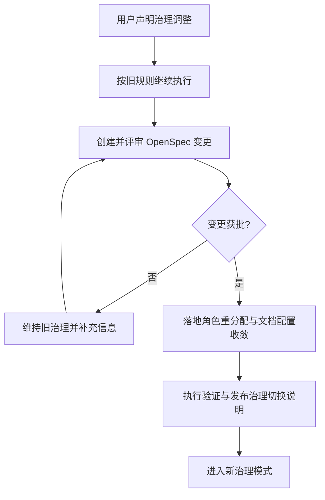

# 调整多Agent治理与职责分配（Codex接管）

## 背景与动机（Why）
- 当前治理口径存在漂移：运行配置已是 `claude_code + codex`，但部分协作文档仍以 `claude + copilot` 为主口径。
- 用户已明确声明：CodeArts 不再担任“技术合伙人”，改为替代 Copilot 的执行辅助位；Claude Code 执行力强但不承担全局统筹；Codex 获得开发管理权。
- 需要在“不破坏现有协作纪律”的前提下，完成一轮可审计、可回滚的治理收敛。

## 目标与范围（What）

### In Scope
- 建立“治理切换期”规则：在变更获批前，继续遵循现有规则；获批后按新治理口径执行。
- 明确三方职责与边界：
  - Codex：技术合伙人/开发管理（全局计划、任务分配、质量门禁、风险控制）
  - Claude Code：执行主力（按任务批次实现与验证）
  - CodeArts：执行辅助（替代 Copilot，负责测试补齐/文档初稿/并行验证，不承担全局治理）
- 对齐配置与文档口径：`.vscode/ai-collab.json`、`collaboration/*.md`、`rules/*_rules.md`。
- 形成首批可执行工单模板（任务声明、交付标准、验收命令）。

### Out of Scope
- 不在本变更中重构产品业务功能（Prompt Pack 功能迭代另开 change）。
- 不恢复 Copilot 协作链路。
- 不引入新的外部协作平台或复杂调度基础设施。

## 验收标准（Acceptance Criteria）
1. 角色职责在配置与规则文档中一致，无相互冲突描述。
2. `logs/collaboration_state.json` 的任务分配与新角色口径一致（CodeArts 不再接收全局治理任务，仅接收执行辅助任务）。
3. 产出一份“治理切换生效说明”，包含回滚步骤。
4. 通过最小回归验证（CLI、状态管理、协作门禁）且全量测试继续通过。

## 核心流程（Mermaid）

## 风险与回滚（Risk & Rollback）
- 风险：治理切换期间职责不清导致重复执行或漏执行。  
  缓解：切换前后各发布一份“当前有效规则”，并绑定生效时间戳。
- 风险：历史文档口径冲突影响执行。  
  缓解：建立“Single Source of Truth”章节并标注废弃文档。
- 回滚：保留旧版配置与规则快照；若切换后 24 小时内出现高优先级异常，恢复到切换前版本并重开评审。
