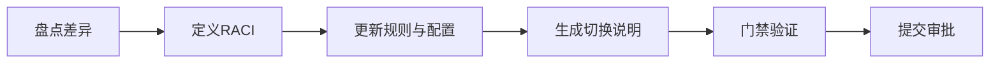

# Tasks

## 增量任务（3–5 steps）
- [x] 1. 完成治理基线盘点：列出当前配置、规则、状态文件中的角色口径差异。
- [x] 2. 定义新治理 RACI（Codex/Claude/CodeArts）与切换生效条件，写入规则文档。
- [x] 3. 调整配置与协作协议文档，确保与新角色口径一致。
- [x] 4. 生成“治理切换说明 + 回滚说明”，并同步到 `collaboration/results/`。
- [x] 5. 执行门禁验证（CLI + 状态管理 + 全量测试），输出验证结论。

## 实施流程（Mermaid）


## 质量门禁（必须跑）

### Backend
```bash
python3 -m ruff check ai_collab/ src/ai_collab/
python3 -m mypy ai_collab/ src/ai_collab/ --ignore-missing-imports
python3 -m pytest -q
```

### Frontend
```bash
# 如本次未改前端，可记录 N/A；如有改动，执行对应门禁
npm run lint
npm run typecheck
```

## OpenSpec 校验（如适用）

```bash
openspec validate update-agent-governance-handover --strict
```
